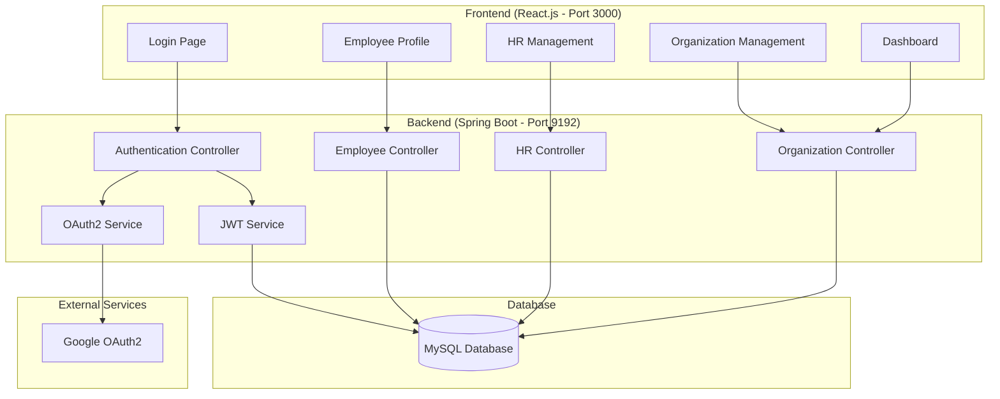
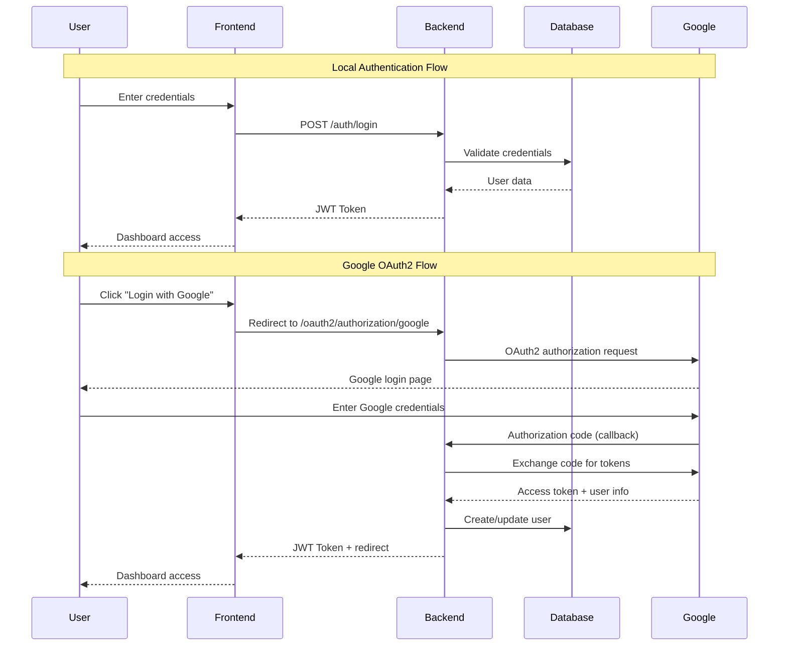

# Organization Registration & Outreach Management System

## Overview
A comprehensive full-stack web application for managing organizational outreach and employee registration. Built with Spring Boot backend, React.js frontend, and integrated Google OAuth2 authentication alongside traditional JWT-based login.

## 🚀 Features
- **Dual Authentication System**: Local JWT authentication + Google OAuth2 SSO
- **Organization Management**: Complete CRUD operations for organizations
- **HR Contact Management**: Manage HR contacts for each organization  
- **Employee Management**: Employee registration and profile management
- **Secure API**: JWT-protected REST endpoints
- **Responsive UI**: Modern React.js frontend
- **File Upload**: Profile picture and document upload support

## 🏗️ System Architecture



## 🔐 Authentication Flow



## 🛠️ Technologies

### Backend
- **Java 17** - Programming language
- **Spring Boot 3.3.5** - Application framework
- **Spring Security** - Authentication & authorization
- **Spring Data JPA** - Data persistence
- **Hibernate** - ORM framework
- **MySQL** - Database
- **JWT** - Token-based authentication
- **OAuth2** - Google SSO integration
- **Maven** - Dependency management

### Frontend
- **React.js 18** - UI framework
- **React Router DOM** - Client-side routing
- **Axios** - HTTP client
- **CSS3** - Styling
- **JavaScript ES6+** - Programming language

## ⚙️ Google OAuth2 Configuration

### Step 1: Google Cloud Console Setup
1. Go to [Google Cloud Console](https://console.cloud.google.com/)
2. Create a new project or select an existing one
3. Enable the **Google+ API** and **Google OAuth2 API**

### Step 2: Create OAuth2 Credentials
1. Navigate to **"Credentials"** → **"Create Credentials"** → **"OAuth 2.0 Client IDs"**
2. Choose **"Web application"** as application type
3. Set **Authorized JavaScript origins**:
   ```
   http://localhost:3000
   ```
4. Set **Authorized redirect URIs**:
   ```
   http://localhost:9192/oauth2/callback/google
   ```
5. Click **"Create"** and copy the **Client ID** and **Client Secret**

### Step 3: Environment Variables Setup
Create a `.env` file in the project root or export environment variables:

```bash
# Google OAuth2 Configuration
export GOOGLE_CLIENT_ID="your-google-client-id-here"
export GOOGLE_CLIENT_SECRET="your-google-client-secret-here"

# Database Configuration (optional - defaults provided)
export DATABASE_URL="jdbc:mysql://localhost:3306/ESDProject?createDatabaseIfNotExist=true"
export DATABASE_USERNAME="root"
export DATABASE_PASSWORD="your-db-password"
```

> **⚠️ Security Note**: Never commit actual credentials to version control. Use environment variables or `.env` files (which are gitignored).

## 🚀 Getting Started

### Prerequisites
- **Java 17+** installed
- **Node.js 16+** and npm installed
- **MySQL 8.0+** running
- **Git** for cloning the repository

### Clone Repository
```bash
git clone https://github.com/Prabhav49/Organisation_Registration.git
cd Organisation_Registration
```

### Database Setup
1. Start MySQL service:
   ```bash
   sudo systemctl start mysql
   ```
2. Create database (auto-created by application):
   ```sql
   CREATE DATABASE IF NOT EXISTS ESDProject;
   ```

### Backend Setup & Start

#### Option 1: Using Environment Variables (Recommended)
```bash
# Set environment variables
export GOOGLE_CLIENT_ID="your-google-client-id"
export GOOGLE_CLIENT_SECRET="your-google-client-secret"

# Clean install dependencies
./mvnw clean install

# Start Spring Boot application
./mvnw spring-boot:run
```

#### Option 2: Using Start Script
```bash
# Make script executable
chmod +x start-backend-with-env.sh

# Edit the script with your credentials
nano start-backend-with-env.sh

# Run the script
./start-backend-with-env.sh
```

**Backend will start on:** `http://localhost:9192`

### Frontend Setup & Start

```bash
# Navigate to frontend directory
cd frontend

# Install dependencies
npm install

# Start React development server
npm start
```

**Frontend will start on:** `http://localhost:3000`

## 📁 Project Structure

```
Organisation_Registration/
├── src/main/java/com/prabhav/employee/
│   ├── auth/                          # Authentication services
│   │   ├── AuthService.java           # JWT authentication logic
│   │   ├── JwtUtil.java               # JWT token utilities
│   │   ├── JwtAuthenticationFilter.java # JWT filter
│   │   └── oauth2/                    # OAuth2 implementation
│   │       ├── CustomOAuth2UserService.java
│   │       ├── OAuth2AuthenticationSuccessHandler.java
│   │       └── OAuth2AuthenticationFailureHandler.java
│   ├── config/
│   │   └── SecurityConfig.java        # Spring Security configuration
│   ├── controller/                    # REST API controllers
│   │   ├── AuthController.java        # Authentication endpoints
│   │   ├── EmployeeController.java    # Employee management
│   │   ├── OrganizationController.java# Organization management
│   │   └── HRController.java          # HR contact management
│   ├── entity/                        # JPA entities
│   │   ├── Employee.java              # Employee entity
│   │   ├── Organization.java          # Organization entity
│   │   └── HRContact.java             # HR contact entity
│   ├── repo/                          # JPA repositories
│   └── service/                       # Business logic services
├── frontend/
│   ├── src/
│   │   ├── components/                # Reusable React components
│   │   │   ├── GoogleLoginButton.js   # Google OAuth2 login
│   │   │   ├── OAuth2RedirectHandler.js # OAuth2 callback handler
│   │   │   ├── PrivateRoute.js        # Protected routes
│   │   │   └── Navbar.js              # Navigation component
│   │   ├── pages/                     # Application screens
│   │   │   ├── Login.js               # Login page
│   │   │   ├── Dashboard.js           # Main dashboard
│   │   │   ├── Profile.js             # User profile
│   │   │   ├── AddOrganization.js     # Organization form
│   │   │   └── ViewHRs.js             # HR management
│   │   ├── services/
│   │   │   └── AuthService.js         # API service layer
│   │   └── utils/                     # Utility functions
│   └── public/                        # Static assets
├── .env.example                       # Environment variables template
├── .gitignore                         # Git ignore rules
└── README.md                          # This file
```

## 🔗 API Endpoints

### Authentication
- `POST /auth/login` - Local login with email/password
- `POST /auth/register` - User registration
- `GET /oauth2/authorization/google` - Initiate Google OAuth2 login
- `GET /oauth2/callback/google` - Google OAuth2 callback

### Organizations
- `GET /api/organizations` - Get all organizations
- `POST /api/organizations` - Create new organization
- `PUT /api/organizations/{id}` - Update organization
- `DELETE /api/organizations/{id}` - Delete organization

### HR Contacts
- `GET /api/hr/{orgId}` - Get HR contacts for organization
- `POST /api/hr` - Create HR contact
- `PUT /api/hr/{id}` - Update HR contact
- `DELETE /api/hr/{id}` - Delete HR contact

### Employee
- `GET /api/employee/profile` - Get current user profile
- `PUT /api/employee/profile` - Update user profile

> **📚 Complete API Documentation:** [Postman Collection](https://documenter.getpostman.com/view/39229910/2sAYBXBWAf)

## 🔍 Testing the Application

### 1. Local Authentication Test
1. Open `http://localhost:3000`
2. Click "Sign Up" to create a new account
3. Login with email/password credentials
4. Access dashboard and test CRUD operations

### 2. Google OAuth2 Test
1. Open `http://localhost:3000`
2. Click "Login with Google" button
3. Complete Google authentication
4. Verify automatic account creation/login
5. Test dashboard functionality

### 3. API Testing
Use the provided Postman collection or curl commands:
```bash
# Login and get JWT token
curl -X POST http://localhost:9192/auth/login \
  -H "Content-Type: application/json" \
  -d '{"email":"user@example.com","password":"password"}'

# Use token to access protected endpoint
curl -X GET http://localhost:9192/api/organizations \
  -H "Authorization: Bearer YOUR_JWT_TOKEN"
```

## 🚀 Deployment

### Production Environment Variables
```bash
# Application
SPRING_PROFILES_ACTIVE=production
SERVER_PORT=9192

# Database
DATABASE_URL=jdbc:mysql://your-db-host:3306/ESDProject
DATABASE_USERNAME=your-db-user
DATABASE_PASSWORD=your-secure-password

# OAuth2
GOOGLE_CLIENT_ID=your-production-client-id
GOOGLE_CLIENT_SECRET=your-production-client-secret

# Frontend URL
APP_FRONTEND_URL=https://your-frontend-domain.com
```

### Build Commands
```bash
# Backend - Create JAR
./mvnw clean package -DskipTests

# Frontend - Create production build
cd frontend && npm run build
```

## 🤝 Contributing
1. Fork the repository
2. Create a feature branch: `git checkout -b feature/amazing-feature`
3. Commit changes: `git commit -m 'Add amazing feature'`
4. Push to branch: `git push origin feature/amazing-feature`
5. Open a Pull Request

## 📝 License
© 2024 Prabhav Pandey, IIITB. All Rights Reserved.

## 📞 Contact
**Prabhav Pandey**  
📧 Email: Prabhav.Pandey@iiitb.ac.in  
🎓 Institution: Indian Institute of Information Technology Bangalore (IIITB)

---

⭐ **Star this repository if you find it helpful!**
